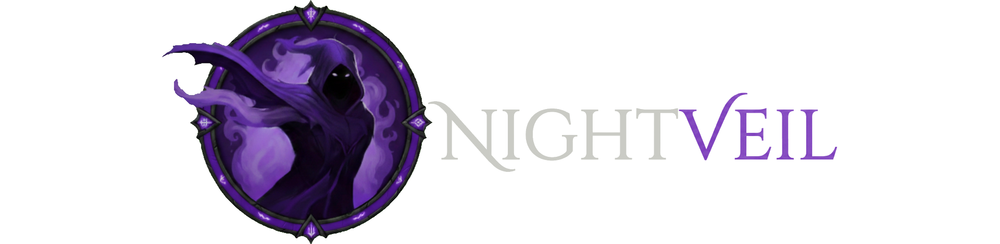
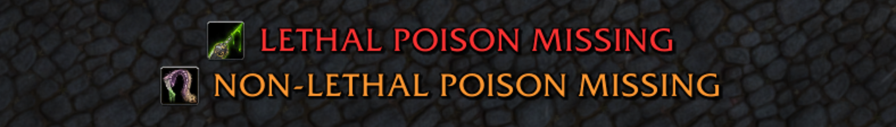

 

**Nightveil** is a Rogue utility addon focused on tracking what matters most during gameplay. It’s a lightweight and customizable toolkit built specifically for Rogues, designed to integrate seamlessly into your UI without getting in the way.

<h2 style="font-size: 20px;">What it does:</h2>

* **Floating Text & Icons:** Visual trackers with full control over size, color, opacity, position, and animations.
* **Instance & Combat Filters:** Show elements only when it makes sense (combat and/or instances).
* **Highly Customizable:** Every system is modular — enable only what you want.
* **Native Localization:** Includes automatic translations for all official WoW game languages.
* **Performance Focused:** Very lightweight. It won’t tank your FPS or stutter your game, even on older PCs.

***

<h2 style="font-size: 20px;">
   Stealth
</h2>

The original core of Nightveil — a clean and highly configurable stealth tracking system.

* Floating text and icon trackers for your current stance
* Optional native character highlight while stealthed
* Fully adjustable visuals and positioning
* Non-intrusive and preserves your existing highlight settings

***

<h2 style="font-size: 20px;">
   Poison Tracker
</h2>

Nightveil includes a dedicated poison monitoring system for both **Lethal** and **Non-Lethal** poisons.

You can independently configure:

* Floating warning text (with custom message, color, size, opacity, offsets, and animations)
* Tracker icons (with anchor options and positioning controls)
* Optional sound alerts
* Combat-only and instance-only visibility

Everything is modular and fully independent between poison types.

***

<h2 style="font-size: 20px;">
   Shroud of Concealment
</h2>

Nightveil includes a dedicated messaging system for **Shroud of Concealment** to help coordinate with your group.

You can easily configure:

* Chat alerts for when Shroud starts and ends
* Custom countdown messages using the **`%time`** variable for remaining time

> **Example:** Setting the text to `Shroud: %time remaining!` will automatically post:

***

<h2 style="font-size: 20px;">
   Tricks of the Trade
</h2>

Nightveil features a smart targeting system for **Tricks of the Trade**, automating your redirects without losing tempo.

* **Smart Macro Management:** Generates a dynamic macro that always reflects your current settings.
* **Target Selector Logic:** Choose between Normal, Tank, Target of Target, or Custom modes.
* **Prioritized Overrides:** Mouseover and Focus targets have their own priority rules.
* **Delve Companion Support:** Automatically targets Brann or other companions inside Delves.
* **Slash Commands:** Control targeting mode:
  * `/veil tricks` — Show current mode and resolved target.
  * `/veil tricks normal` / `tank` / `tt` / `custom` — Switch targeting mode instantly.
  * `/veil tricks list [#]` — List group/raid members and set target by index.
  * `/veil tricks set <name>` — Set a specific player by name.

***

_To open the addon settings, just type: **`/veil`** — or **`/veil help`** to see all available commands._